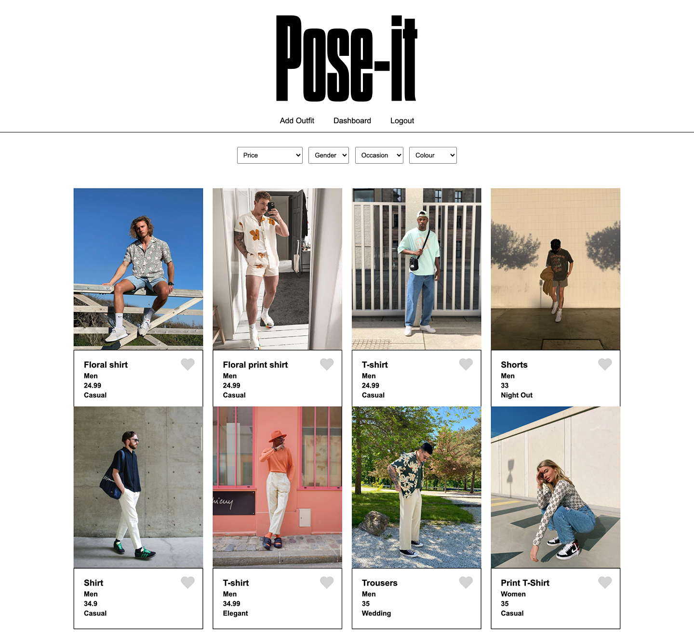
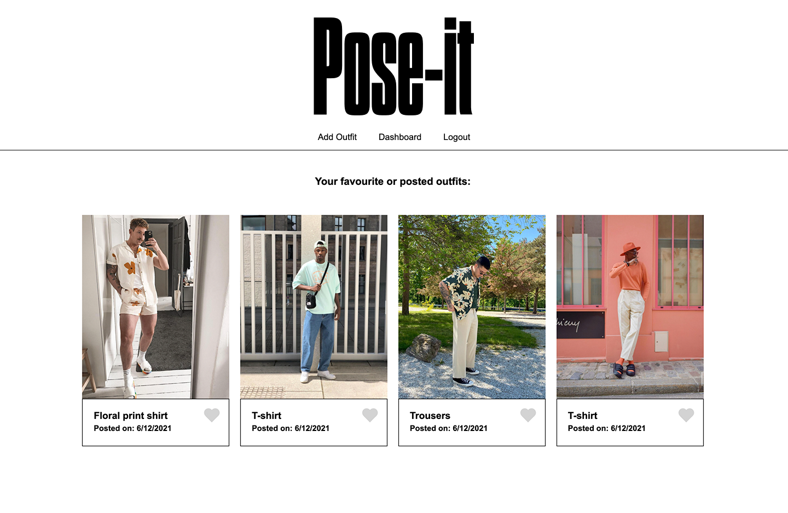
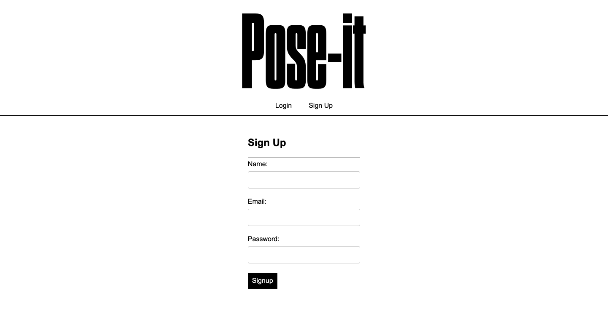

# Pose-It Fashion App

## Deployment / Links

- Heroku: [Heroku](https://pose-it-app.herokuapp.com/)

## Table of Contents

- [Description](#description)
- [Installation](#installation)
- [Usage](#usage)
- [Contributing](#contributing)
- [Tests](#tests)
- [Questions](#questions)
- [Links](#links)
- [Screenshots](#screenshots)
- [License](#license)

## Description

Pose-It - A Fashion App designed to let users build up a wardrobe of inspiration on their digital device. More instaglam, than instagram - it’s all about fashion.

Whether a user has seen an item on clothing while out shopping, online, or simply love what a friend is wearing, this interactive app allows them to Pose-it - save-it - like-it - search it.

A full stack web development application, it allows users to record the details that really matter that they can then fall back on when they’re lacking inspiration for their next outfit.

Users can create their own "Poses" or outfits that have inspired the, uploads photos and details, filter all user posts to find outfits to match their specific criteria, save them to their personal dashboard and delete any items that they are no longer interested in.

## Installation

The app works in any browser at the deployed link below.

However, to install the project please use the following package manager:

- enter 'npm init' in the terminal to install all packages.

- Please ensure all dependencies and dev dependencies are installed ((npm install {package}).

- Dependencies: brcrypt, cloudinary, connect-session sequelize, datauri, dotenv, express, express-csp-header, express-fileupload, express-handlebars, express-session, helmet, mysql2, nodemon, sequelize, sort-array.

- Dev dependencies: eslint, eslint-config-airbnb-base, eslint-plugin-import, prettier.

- enter 'npm run seed' to run all seed data for the outfits.

## Usage

Download, install NPM packages, enter npm run dev / node server.js / nodemon server.js to activate server on Port 3001 and run the app.

## Technologies Used

- The Pose-It app uses Node.js and Express.js to create a RESTful API.

- The app uses Handlebars.js as a template engine, with a main handlebars template, then individual templates to render displays for multiple outfits, a single outfit, the dashboard, sign-up, and login.

- MySQL and the Sequelize ORM (Object Relational Mapping) to connect the app our outfits_db database storing all of the user inputted data.

- The app uses GET routes to retrieve data (to render single outfit, multiple outfits and liked outfits), POST routes (for retrieving and adding new data from seeds and user created outfits), plus DELETE routes to remove unwanted outfits.

- Security features include the use of Login Authentication from the npm express-session package, hooks (withAuth middleware) and cookies. Environment variables safely store API keys and sensitive information protected (.env files). Cloudinary - gives unique and secure URL to user uploaded images.

- CSS & HTML - Give the app it's polished UI, mobile responsiveness, and design features, enhanced with

- ESLINT & PRETTIER pluggins have been utilised to help create a clean codebase and to meet good-quality coding standards.

- The app has been deployed live via Heroku.

## Contributing

To contribute further on this project please contacts the repo owners at the GitHub accounts below. Directions for future development are also highlighted as below.

### Directions for Future Developmen

- Divide “outfits” into individual items, so that the user can offer descriptions on individual items in an outfit.

- A Mix’n’match feature to allow users to put items from different outfits together.

- Increase interactivity, e.g. allow users to comment on each others outfits.

- Link to online shopping retailers to allow users to create “Wishlists” of items they have seen online.

- Add a “search” option to more comprehensively search through outfits as well as filters.

## Tests

All routes tested in Insomnia during development process. Further testing with jest package proposed for future development.

## Questions

For any further questions, please contact GitHub users:
- [Raul Sanz](https://github.com/itsraulsanz)
- [Thom Williams](https://www.github.com/ThomWilliams/)
- [Temi Lanre-Adewumi](https://github.com/TemyTemy)

Or for direct enquiries please email the follower developer address:
luarznas@gmail.com

## Screenshot

## Links

- Project Repository: [GitHub](https://github.com/itsraulsanz/outfit-app)

- Issue tracker: [GitHub Issues](https://github.com/itsraulsanz/outfit-app/issues)

## License

MIT

Copyright (c) [2021] [Pose-It]

Permission is hereby granted, free of charge, to any person obtaining a copy
of this software and associated documentation files (the "Software"), to deal
in the Software without restriction, including without limitation the rights
to use, copy, modify, merge, publish, distribute, sublicense, and/or sell
copies of the Software, and to permit persons to whom the Software is
furnished to do so, subject to the following conditions:

The above copyright notice and this permission notice shall be included in all
copies or substantial portions of the Software.

THE SOFTWARE IS PROVIDED "AS IS", WITHOUT WARRANTY OF ANY KIND, EXPRESS OR
IMPLIED, INCLUDING BUT NOT LIMITED TO THE WARRANTIES OF MERCHANTABILITY,
FITNESS FOR A PARTICULAR PURPOSE AND NONINFRINGEMENT. IN NO EVENT SHALL THE
AUTHORS OR COPYRIGHT HOLDERS BE LIABLE FOR ANY CLAIM, DAMAGES OR OTHER
LIABILITY, WHETHER IN AN ACTION OF CONTRACT, TORT OR OTHERWISE, ARISING FROM,
OUT OF OR IN CONNECTION WITH THE SOFTWARE OR THE USE OR OTHER DEALINGS IN THE
SOFTWARE.
